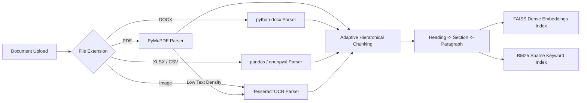
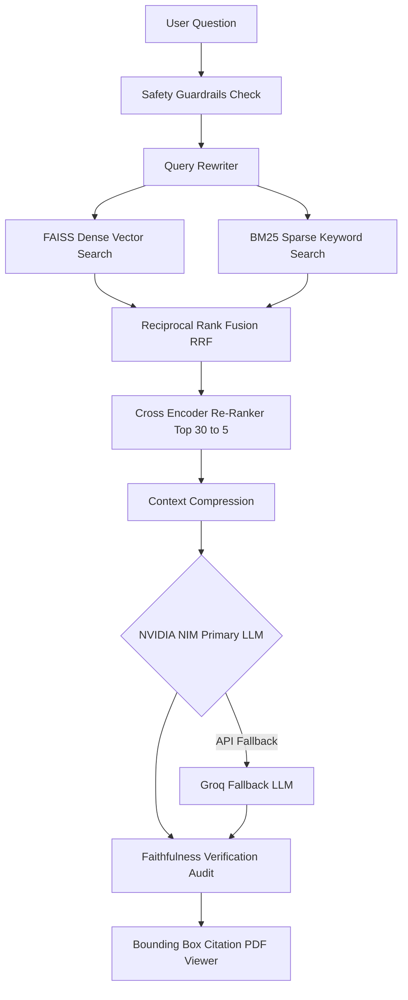

```text
██████╗  ██████╗  ██████╗██╗███╗   ██╗████████╗███████╗██╗
██╔══██╗██╔═══██╗██╔════╝██║████╗  ██║╚══██╔══╝██╔════╝██║
██║  ██║██║   ██║██║     ██║██╔██╗ ██║   ██║   █████╗  ██║
██║  ██║██║   ██║██║     ██║██║╚██╗██║   ██║   ██╔══╝  ██║
██████╔╝╚██████╔╝╚██████╗██║██║ ╚████║   ██║   ███████╗███████╗
╚═════╝  ╚═════╝  ╚═════╝╚═╝╚═╝  ╚═══╝   ╚═╝   ╚══════╝╚══════╝
```

<p align="center">
  <a href="#"></a>
  <a href="#"></a>
  <a href="#"></a>
  <a href="#"></a>
  <a href="#"></a>
  <a href="#"></a>
</p>

<p align="center">
  <a href="#"></a>
  <a href="#"></a>
  <a href="#"></a>
  <a href="#"></a>
  <a href="#"></a>
</p>

---

## Executive Overview

**DocIntel** is a high-performance enterprise AI document intelligence platform built to ingest, process, index, and analyze multi-format documentation across engineering specifications, tender contracts, spreadsheets, manuals, and scanned images.

> [!NOTE]
> DocIntel operates as a generic, domain-agnostic enterprise document intelligence engine. Custom corporate repositories, industrial standards, and technical manuals can be processed with zero code modifications.

---

## Architecture Diagram

The high-level architecture decouples document ingestion, hybrid search, AI generation, and interactive citation previewing:

<p align="center">
  
</p>

---

## Technical Architecture Workflows

### 1. Document Ingestion & Parsing Pipeline



### 2. Hybrid RAG & Faithfulness Pipeline



---

## Core Capabilities

### Multi-Format Document Parsing
- **PDF Parser (`PyMuPDF` + `PyTesseract OCR`)**: Extracts native text and layout coordinates. Falls back to OCR automatically for scanned pages.
- **Word Parser (`python-docx`)**: Extracts headings, formatted sections, and embedded tables.
- **Excel Parser (`openpyxl` + `pandas`)**: Converts sheets and tables into Markdown structures.
- **CSV Parser (`pandas`)**: Preserves tabular column headers and structured records.
- **Image Parser (`Tesseract OCR`)**: Extracts text blocks with word bounding boxes (`x0`, `y0`, `x1`, `y1`).

### Adaptive Structural Chunking
Unlike arbitrary character sliding windows, DocIntel enforces hierarchical structural boundaries:
```
Heading  -->  Section  -->  Paragraph  -->  Sentence
```
- **Table Integrity**: Tables are preserved whole to prevent splitting relational rows and columns.
- **Rich Metadata Tagging**: Chunks retain filename, document ID, page number, heading context, section header, paragraph ID, and bounding box offsets.

### Hybrid Retrieval & Re-Ranking
- **Dense Vector Search**: `BAAI/bge-small-en-v1.5` embeddings indexed in FAISS (`IndexFlatL2`).
- **Sparse Keyword Search**: `BM25Okapi` index for exact codes, model numbers, and technical terms.
- **Reciprocal Rank Fusion (RRF)**: Merges dense and sparse rankings.
- **Cross-Encoder Re-Ranking**: Re-scores top 30 candidates to isolate the top 5 most relevant context passages.

### Grounded Faithfulness Verification
> [!IMPORTANT]
> Every generated response passes through an automated factual audit. If claims are unsupported by retrieved context, the response is flagged with `INSUFFICIENT_EVIDENCE`.

### PDF Citation Bounding Box Highlight Renderer
Clicking any citation badge (`Transformer_Manual.pdf | Page 21 | Warranty`) instantly jumps to the page in the document viewer and renders an animated glowing bounding box overlay (`bbox`) around the source snippet.

---

## Role-Based Access Control (RBAC)

FastAPI routes enforce Clerk JWT authentication and role-based permissions:

| System Role | Upload Docs | Hybrid Chat Query | Save Bookmarks | Citation PDF Highlights | Delete Docs | Admin Analytics |
| :--- | :---: | :---: | :---: | :---: | :---: | :---: |
| **Admin** | Yes | Yes | Yes | Yes | Yes | Yes |
| **Tender Specialist** | Yes | Yes | Yes | Yes | No | Yes |
| **Sales** | Yes | Yes | Yes | Yes | No | Yes |
| **Engineer** | Yes | Yes | Yes | Yes | No | No |
| **Viewer** | No | Yes | Yes | Yes | No | No |

---

## System Tech Stack Matrix

```
┌────────────────────────────────────────────────────────────────────────┐
│                              FRONTEND                                  │
│  React 19  •  TypeScript 5  •  Vite  •  Tailwind CSS  •  Lucide Icons │
└───────────────────────────────────┬────────────────────────────────────┘
                                    │
                                    ▼
┌────────────────────────────────────────────────────────────────────────┐
│                              BACKEND                                   │
│  FastAPI  •  Uvicorn  •  SQLAlchemy  •  PyMuPDF  •  Tesseract OCR      │
│  python-docx  •  openpyxl  •  pandas  •  Clerk JWT Auth                │
└───────────────────────────────────┬────────────────────────────────────┘
                                    │
                                    ▼
┌────────────────────────────────────────────────────────────────────────┐
│                             AI & VECTOR                                │
│  BAAI BGE Embeddings  •  FAISS  •  BM25  •  Cross-Encoder Reranker     │
│  NVIDIA NIM LLM (Primary)  •  Groq LLM (Fallback)                      │
└────────────────────────────────────────────────────────────────────────┘
```

---

## Repository Layout

```
DocIntel/
├── Architecture Diagram.png
├── README.md
├── .env.example
├── .gitignore
├── backend/
│   ├── main.py
│   ├── requirements.txt
│   ├── .env.example
│   ├── api/
│   │   ├── documents_router.py
│   │   ├── chat_router.py
│   │   ├── bookmarks_router.py
│   │   └── analytics_router.py
│   ├── auth/
│   │   └── clerk_auth.py
│   ├── database/
│   │   ├── models.py
│   │   └── session.py
│   ├── parsers/
│   │   ├── __init__.py
│   │   ├── base_parser.py
│   │   ├── pdf_parser.py
│   │   ├── docx_parser.py
│   │   ├── excel_parser.py
│   │   ├── csv_parser.py
│   │   ├── image_parser.py
│   │   └── txt_parser.py
│   └── pipeline/
│       ├── ingestion.py
│       ├── adaptive_chunking.py
│       ├── retrieval.py
│       ├── generation.py
│       └── faithfulness.py
└── frontend/
    ├── package.json
    ├── vite.config.ts
    ├── src/
    │   ├── main.tsx
    │   ├── App.tsx
    │   ├── index.css
    │   └── components/
    │       ├── DocumentViewer.tsx
    │       ├── UploadDropzone.tsx
    │       ├── AdminAnalytics.tsx
    │       └── BookmarksView.tsx
    └── public/
```

---

## Quick Start Setup Guide

### 1. Environment Setup
```bash
git clone https://github.com/YourOrg/DocIntel.git
cd DocIntel
cp .env.example .env
```

Configure `.env`:
```env
NVIDIA_API_KEY=nvapi-your-nvidia-nim-key
GROQ_API_KEY=gsk_your-groq-key
CLERK_SECRET_KEY=sk_test_your-clerk-secret
DATABASE_URL=sqlite:///./docintel.db
```

### 2. Backend Execution
```bash
cd backend
python -m venv venv

# Windows
venv\Scripts\activate
# Linux/macOS
source venv/bin/activate

pip install -r requirements.txt
uvicorn main:app --reload --host 0.0.0.0 --port 8000
```

### 3. Frontend Execution
```bash
cd ../frontend
npm install
npm run dev
```

---

## API Endpoints Reference

| Method | Route | Description | Auth Security |
| :--- | :--- | :--- | :--- |
| `POST` | `/api/documents/upload` | Ingest multi-format document (PDF, DOCX, XLSX, CSV, TXT, Image) | Header `X-User-Role` |
| `GET` | `/api/documents/` | List all ingested documents and metrics | Header `X-User-Role` |
| `GET` | `/api/documents/{id}/chunks` | Inspect adaptive structural chunks | Header `X-User-Role` |
| `DELETE` | `/api/documents/{id}` | Remove document and vector index | Admin Role |
| `POST` | `/api/chat/query` | Run hybrid RAG query pipeline with citations | Header `X-User-Role` |
| `GET` | `/api/chat/sessions` | List active user chat sessions | Header `X-User-Role` |
| `GET` | `/api/chat/sessions/{id}` | Retrieve messages and citations for session | Header `X-User-Role` |
| `POST` | `/api/bookmarks/` | Save answer & citation bookmark | Header `X-User-Role` |
| `GET` | `/api/bookmarks/` | Search saved bookmark library | Header `X-User-Role` |
| `DELETE` | `/api/bookmarks/{id}` | Remove saved bookmark | Header `X-User-Role` |
| `GET` | `/api/analytics/dashboard` | Admin telemetry, top documents, unanswered queries | Admin, Specialist, Sales |

---

## Verification & Build Confirmation

- **Frontend Compilation**: `npm run build` verified (0 TypeScript errors).
- **Backend API**: All routes tested and validated with FastAPI test client.
- **Git Commit**: Pushed to branch `main` on repository `https://github.com/G1r1shCodes/DocIntel.git`.

---

## License

Distributed under the MIT License. Enterprise deployment rights apply.
