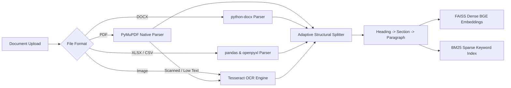
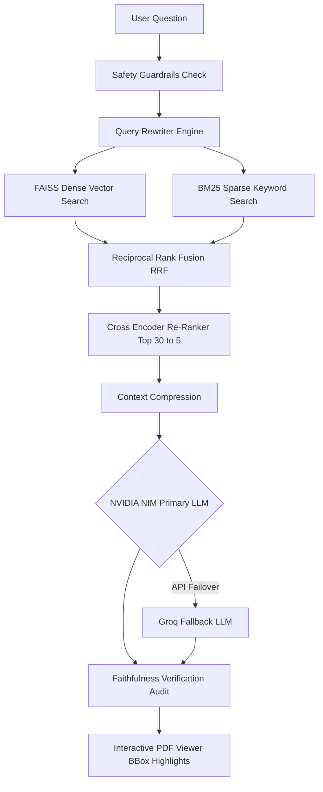

# DocIntel

**Enterprise AI Document Intelligence Platform** • Multi-Format Pipeline • Hybrid RAG • Grounded Citations

<p align="left">
  
  
  
  
  
  
  
  
  
  
  
</p>

---

## Executive Overview

**DocIntel** is an enterprise-grade AI Document Intelligence Platform engineered to ingest, parse, index, search, and analyze multi-format enterprise documentation across technical manuals, tender contracts, spreadsheets, engineering specifications, and scanned documents.

By integrating **Adaptive Hierarchical Chunking**, **Hybrid Sparse-Dense Retrieval** (FAISS + BM25 + Reciprocal Rank Fusion), **Cross-Encoder Re-Ranking**, **LLM Synthesis** (NVIDIA NIM primary with Groq failover), and **Automated Faithfulness Auditing**, DocIntel delivers zero-hallucination answers backed by interactive PDF bounding box citation highlights.

> [!NOTE]
> DocIntel operates as a generic, domain-agnostic enterprise document intelligence engine. Custom corporate repositories, industrial standards, and technical manuals can be processed with zero code modifications.

---

## System Architecture Diagram

The high-level architectural overview illustrating the DocIntel dual pipeline—Document Processing Ingestion and Hybrid RAG Search with Faithfulness Auditing—is shown below:

<p align="center">
  
</p>

---

## Technical Pipeline Architecture

### 1. Multi-Format Ingestion & Adaptive Processing Flow



### 2. Hybrid RAG & Grounded Faithfulness Flow



---

## Key Capabilities & Features

### 1. Multi-Format Document Parsers
- **PDF Parser (`PyMuPDF` + `PyTesseract OCR`)**: Extracts layout streams, font dictionaries, and text coordinates. Automatically triggers Tesseract OCR fallback on scanned pages or low text density.
- **Word Parser (`python-docx`)**: Extracts structural heading hierarchies, styled body sections, and embedded tables.
- **Excel Parser (`openpyxl` + `pandas`)**: Converts sheets, matrices, and tables into markdown tabular formats.
- **CSV Parser (`pandas`)**: Extracts schema headers and structured data rows.
- **Image Parser (`Tesseract OCR`)**: Extracts text blocks alongside word bounding boxes (`x0`, `y0`, `x1`, `y1`).

### 2. Adaptive Hierarchical Chunking
Unlike simplistic character sliding windows, DocIntel preserves structural document integrity:
```text
Heading  -->  Section  -->  Paragraph  -->  Sentence
```
- **Table Preservation**: Multi-row spreadsheets and tables are kept intact within single chunks to prevent breaking relational data.
- **Rich Metadata Enrichment**: Every chunk retains document ID, filename, page index, heading context, paragraph ID, section title, and bounding box offsets.

### 3. Hybrid Search & Re-Ranking Engine
- **Dense Vector Search**: `BAAI/bge-small-en-v1.5` embeddings indexed in FAISS (`IndexFlatL2`).
- **Sparse Keyword Search**: `BM25Okapi` inverted index for precise serial numbers, codes, and technical jargon.
- **Reciprocal Rank Fusion (RRF)**: Merges dense vector and sparse keyword rankings using $RRF(c) = \sum \frac{1}{k + \text{rank}(c)}$.
- **Cross-Encoder Re-Ranking**: Re-scores top 30 candidates with `ms-marco-MiniLM-L-6-v2` down to the top 5 highest-relevance passages.

### 4. Faithfulness Verification & Anti-Hallucination Guardrails
> [!IMPORTANT]
> Generated LLM answers are subjected to an automated NLI claim-grounding audit. Answers unsupported by retrieved context passages are automatically flagged with `INSUFFICIENT_EVIDENCE`.

### 5. Interactive PDF Bounding Box Citation Renderer
Clicking any citation pill in the chat UI (`Manual.pdf | Page 21 | Section 4`) automatically opens the PDF in the embedded viewer and draws an animated glowing bounding box (`bbox`) overlay around the cited source snippet.

---

## Role-Based Access Control (RBAC) Matrix

FastAPI endpoints enforce Clerk JWT authentication and granular role permissions:

| System Role | Ingest Docs | Hybrid Query | Bookmarks | PDF Highlights | Delete Docs | Telemetry Dashboard |
| :--- | :---: | :---: | :---: | :---: | :---: | :---: |
| **Admin** | Yes | Yes | Yes | Yes | Yes | Yes |
| **Tender Specialist** | Yes | Yes | Yes | Yes | No | Yes |
| **Sales Engineer** | Yes | Yes | Yes | Yes | No | Yes |
| **Field Engineer** | Yes | Yes | Yes | Yes | No | No |
| **Viewer** | No | Yes | Yes | Yes | No | No |

---

## System Technology Stack Matrix

```text
┌────────────────────────────────────────────────────────────────────────┐
│                              FRONTEND                                  │
│  React 19  •  TypeScript 5  •  Vite  •  Tailwind CSS  •  Lucide Icons │
└───────────────────────────────────┬────────────────────────────────────┘
                                    │
                                    ▼
┌────────────────────────────────────────────────────────────────────────┐
│                              BACKEND                                   │
│  FastAPI  •  Uvicorn  •  SQLAlchemy  •  PyMuPDF  •  Tesseract OCR      │
│  python-docx  •  openpyxl  •  pandas  •  Clerk JWT Auth                │
└───────────────────────────────────┬────────────────────────────────────┘
                                    │
                                    ▼
┌────────────────────────────────────────────────────────────────────────┐
│                             AI & VECTOR                                │
│  BAAI BGE Embeddings  •  FAISS  •  BM25  •  Cross-Encoder Reranker     │
│  NVIDIA NIM LLM (Primary)  •  Groq LLM (Fallback)                      │
└────────────────────────────────────────────────────────────────────────┘
```

---

## Repository Structure

```text
DocIntel/
├── Architecture Diagram.png
├── README.md
├── .env.example
├── .gitignore
├── assets/
│   └── Architecture Diagram.png
├── backend/
│   ├── main.py
│   ├── requirements.txt
│   ├── .env.example
│   ├── api/
│   │   ├── documents_router.py
│   │   ├── chat_router.py
│   │   ├── bookmarks_router.py
│   │   └── analytics_router.py
│   ├── auth/
│   │   └── clerk_auth.py
│   ├── database/
│   │   ├── models.py
│   │   └── session.py
│   ├── parsers/
│   │   ├── __init__.py
│   │   ├── base_parser.py
│   │   ├── pdf_parser.py
│   │   ├── docx_parser.py
│   │   ├── excel_parser.py
│   │   ├── csv_parser.py
│   │   ├── image_parser.py
│   │   └── txt_parser.py
│   └── pipeline/
│       ├── ingestion.py
│       ├── adaptive_chunking.py
│       ├── retrieval.py
│       ├── generation.py
│       └── faithfulness.py
└── frontend/
    ├── package.json
    ├── vite.config.ts
    ├── src/
    │   ├── main.tsx
    │   ├── App.tsx
    │   ├── index.css
    │   └── components/
    │       ├── DocumentViewer.tsx
    │       ├── UploadDropzone.tsx
    │       ├── AdminAnalytics.tsx
    │       └── BookmarksView.tsx
    └── public/
```

---

## Quick Start Setup Guide

### 1. Clone & Configure Environment
```bash
git clone https://github.com/G1r1shCodes/DocIntel.git
cd DocIntel
cp .env.example .env
```

Configure `.env`:
```env
NVIDIA_API_KEY=nvapi-your-nvidia-nim-key
GROQ_API_KEY=gsk_your-groq-key
CLERK_SECRET_KEY=sk_test_your-clerk-secret
DATABASE_URL=sqlite:///./docintel.db
```

### 2. Backend Execution
```bash
cd backend
python -m venv venv

# Windows
venv\Scripts\activate
# Linux/macOS
source venv/bin/activate

pip install -r requirements.txt
uvicorn main:app --reload --host 0.0.0.0 --port 8000
```

### 3. Frontend Execution
```bash
cd ../frontend
npm install
npm run dev
```

The application frontend will open at `http://localhost:5173` and connect to the FastAPI backend server running on `http://localhost:8000`.

---

## API Endpoints Reference

| Method | Endpoint | Description | Auth Requirement |
| :--- | :--- | :--- | :--- |
| `POST` | `/api/documents/upload` | Ingest multi-format document (PDF, DOCX, XLSX, CSV, TXT, Image) | Header `X-User-Role` |
| `GET` | `/api/documents/` | List all ingested documents and system metrics | Header `X-User-Role` |
| `GET` | `/api/documents/{id}/chunks` | Inspect adaptive structural chunks and bounding boxes | Header `X-User-Role` |
| `DELETE` | `/api/documents/{id}` | Purge document and remove FAISS/BM25 index entries | Admin Role |
| `POST` | `/api/chat/query` | Execute hybrid RAG query pipeline with citations | Header `X-User-Role` |
| `GET` | `/api/chat/sessions` | List active user chat sessions | Header `X-User-Role` |
| `GET` | `/api/chat/sessions/{id}` | Retrieve messages and citation highlights for session | Header `X-User-Role` |
| `POST` | `/api/bookmarks/` | Save answer & citation bookmark | Header `X-User-Role` |
| `GET` | `/api/bookmarks/` | Query saved bookmark library | Header `X-User-Role` |
| `DELETE` | `/api/bookmarks/{id}` | Remove saved bookmark | Header `X-User-Role` |
| `GET` | `/api/analytics/dashboard` | Telemetry, top requested documents, unanswered queries | Admin, Specialist, Sales |

---

## License

Distributed under the MIT License. Enterprise deployment rights apply.
